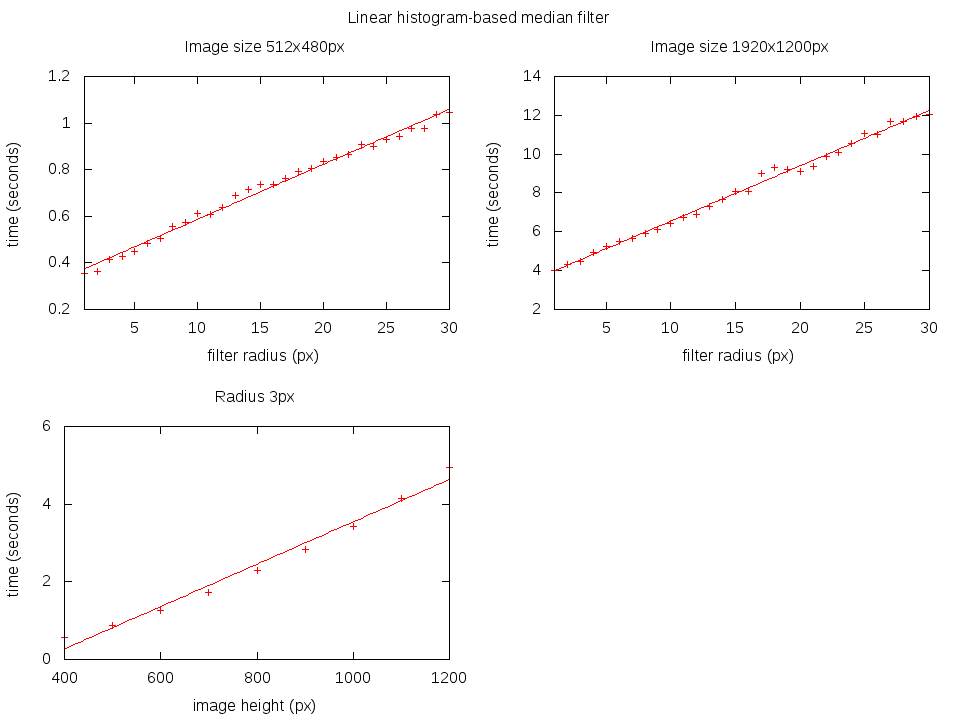

# Exercise 2: Fast Median Filter

This program uses the histogram approach from Thomas S. Huang as described in the
paper [A Fast Two-Dimensional Median Filtering Algorithm, 1979](https://www.freelists.org/archives/ingsw3/11-2013/pdfNNRwXsvXQN.pdf).
It is linear with respect to the filter radius.

There is a constant time algorithm described in [Median Filtering in Constant Time](http://vision.gel.ulaval.ca/~perreaul/publications/Id699_2007.pdf)
by Simon Perreault and Patrick Hebert. But there was not enough time to get a proper implementation.


## Build

The program has no other dependencies than OpenCV 2.4.9

```bash
# Generate the Makefile and compile the program
$ cmake .
$ make

# Read the help page to get further information
$ ./fast_median_filter --help
```


## Performance

As described in the paper, the complexity of the histogram based algorithm is linear
in the filter radius and image size (amount of pixels).

    O(n*r)

where `n` is the amount of pixels and `r` the filter radius.

The follwing plots shows the predicted time complexity of the algorithm

