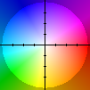

# Lab 4: Optical flow

Compute the **[Optical Flow](http://en.wikipedia.org/wiki/Optical_flow)**:

 * Motion in 2D instead of 1D
 * Color the xy motion according to the HSV color wheel
   


## Build

The project has no other dependencies than OpenCV v2.4.9. You can build the
project with `cmake`:

```bash
# generate Makefile
$ cmake .

# compile binary
$ make

# execute
$ ./optical_flow <frame1> <frame2>
```